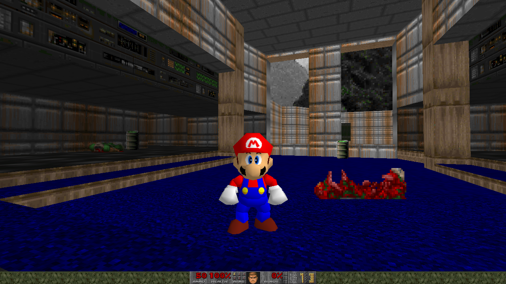

# gzdoom-sm64
A fork of gzdoom 3.2.0 which replaces the player with Mario from Super Mario 64 by using libsm64


This is still a work in progress.

## Compiling
Create `build` folder and run cmake inside that folder:
```
cmake ..
make
```
Alternatively you can skip this and download a development build at the Actions tab above if you wish to try this out

## Running the game
You will need a DOOM wad and the Super Mario 64 US ROM (filename sm64.us.z64) in order to play. Should work with some DOOM mods as well
